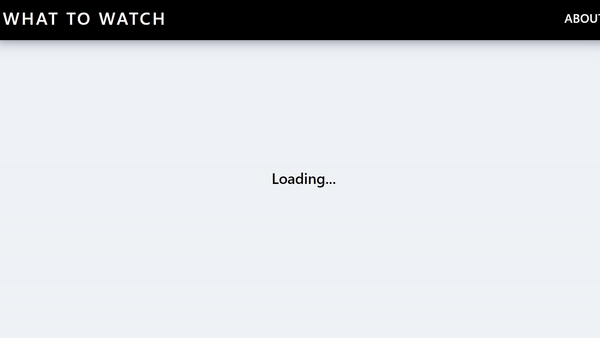

# Movie App

- 링크 : https://zeroaan.github.io/what_to_watch/
- 기간 : 20년 9월 7일 ~ 9월 10일

<br>



<br>

컴포넌트들을 생성하고 사용하는 방법에 대해서 알아보았고, <br>
라우터와 라우트를 통해 페이지 이동을 해봤습니다.

<br>

#### Movie.js

```javascript
import React from "react";
import { Link } from "react-router-dom";
import PropTypes from "prop-types";
import "./Movie.css";

function Movie({ id, year, title, summary, poster, genres }) {
  return (
    <div className="movie">
      <Link
        to={{
          pathname: `/movie/${id}`,
          state: {
            year,
            title,
            summary,
            poster,
            genres,
          },
        }}
      >
        
        <div className="movie__data">
          <h3 className="movie__title">{title}</h3>
          <h5 className="movie__year">{year}</h5>
          <ul className="movie__genres">
            {genres.map((genre, index) => (
              <li key={index} className="genres__genre">
                {genre}
              </li>
            ))}
          </ul>
        </div>
      </Link>
    </div>
  );
}

Movie.propTypes = {
  id: PropTypes.number.isRequired,
  year: PropTypes.number.isRequired,
  title: PropTypes.string.isRequired,
  summary: PropTypes.string.isRequired,
  poster: PropTypes.string.isRequired,
  genres: PropTypes.arrayOf(PropTypes.string).isRequired,
};

export default Movie;
```

<br>

#### Home.js

```javascript
import React from "react";
import axios from "axios";
import Movie from "../components/Movie";
import "./Home.css";

class Home extends React.Component {
  state = {
    isLoading: true,
    movies: [],
  };
  getMovies = async () => {
    const {
      data: {
        data: { movies },
      },
    } = await axios.get(
      "https://yts-proxy.now.sh/list_movies.json?sort_by=rating"
    );
    this.setState({ movies, isLoading: false });
  };
  componentDidMount() {
    this.getMovies();
  }
  render() {
    const { isLoading, movies } = this.state;
    return (
      <section className="container">
        {isLoading ? (
          <div className="loader">
            <span className="loader__text">Loading...</span>
          </div>
        ) : (
          <div className="movies">
            {movies.map((movie) => (
              <Movie
                key={movie.id}
                id={movie.id}
                year={movie.year}
                title={movie.title}
                summary={movie.summary}
                poster={movie.medium_cover_image}
                genres={movie.genres}
              />
            ))}
          </div>
        )}
      </section>
    );
  }
}

export default Home;
```

<br>

#### 마지막으로 HashRouter와 Route를 이용한 App.js

```javascript
import React from "react";
import { HashRouter, Route } from "react-router-dom";
import Home from "./routes/Home";
import About from "./routes/About";
import Detail from "./routes/Detail";
import Navigation from "./components/Navigation";

function App() {
  return (
    <HashRouter>
      <Navigation />
      <Route path="/" exact={true} component={Home} />
      <Route path="/about" component={About} />
      <Route path="/movie/:id" component={Detail} />
    </HashRouter>
  );
}

export default App;
```
